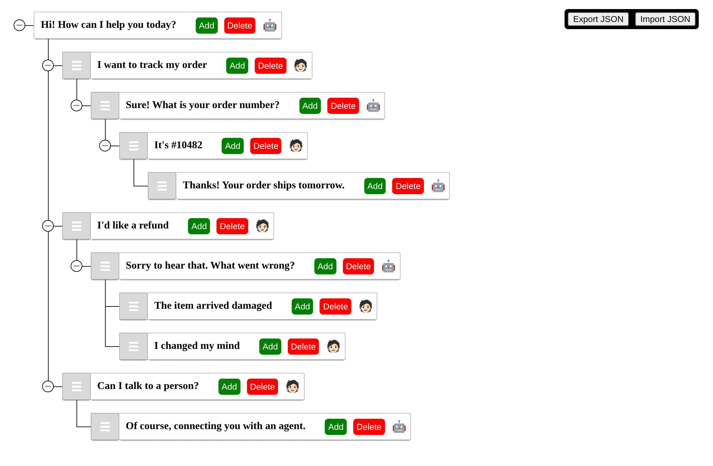
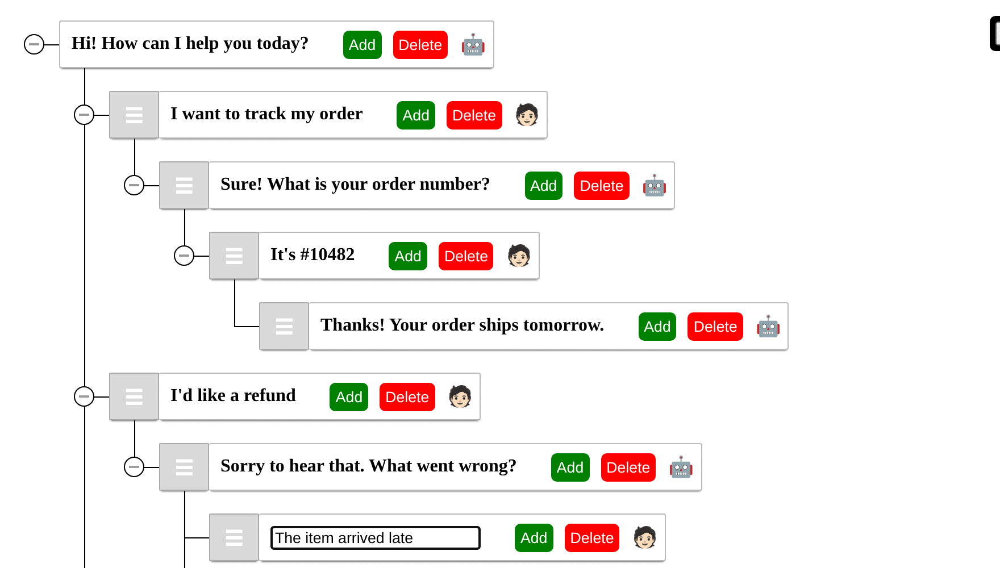

<p align="center">
  
</p>

<h1 align="center">Dialogue Tree Builder</h1>

<p align="center">
  Sketch branching chatbot conversations as a tree of bot and user turns,<br />
  right in the browser, and export them as JSON.
</p>

<p align="center">
  <a href="https://github.com/helalaou/Dialogue-tree-builder/actions/workflows/ci.yml"></a>
  <a href="License.md"></a>
  <a href="https://doi.org/10.1007/978-3-031-79164-2_7"></a>
  
  
</p>

<p align="center">
  
</p>

## Overview

Dialogue Tree Builder is a small single-page React app for mapping out the conversations a chatbot
should handle. Each node in the tree is one turn, marked as either a **bot** message or a **user**
message, and each branch is a different way the conversation can go. The result can be exported as
a JSON file and used as structured data when building or training a chatbot.

The tool was built for
[*DarijaGenie*](https://doi.org/10.1007/978-3-031-79164-2_7) (see [Citation](#citation)), a
framework for building task-based conversational tutors for low-resource languages. DarijaGenie
was evaluated on Moroccan Arabic (Darija), a mostly spoken dialect with little standardized
spelling and almost no structured learning material, as a deliberately hard test case: an approach
that works there should carry over to other under-resourced languages. Dialogue Tree Builder is how
the tutor's scenario dialogues were authored, and it works the same way for any language.

Everything runs in the browser. There is no backend and no account: the tree lives in memory
while you work, and you save it by exporting it to a file.

## Features

|                         |                                                                                                                                   |
| ----------------------- | --------------------------------------------------------------------------------------------------------------------------------- |
| **Bot and user turns**  | Every node is tagged `BOT` (🤖) or `USER` (🧑🏻). Click the icon to switch a node between the two.                                    |
| **Branching replies**   | **Add** creates a child under any node, so one bot message can lead to several possible user replies and vice versa.             |
| **Inline editing**      | Click a node's text to edit it in place, then press <kbd>Enter</kbd> to save.                                                      |
| **Drag and drop**       | Grab a node by its handle to reorder it or move it, with its whole branch, under a different parent. Branches can be collapsed. |
| **Delete branches**     | **Delete** removes a node together with everything below it.                                                                      |
| **Protected root**      | The conversation's opening bot message cannot be deleted, dragged or turned into a user turn.                                     |
| **JSON export**         | **Export JSON** downloads the whole tree as `data.json`.                                                                          |
| **JSON import**         | **Import JSON** loads a previously exported file so you can keep working on it.                                                  |

<p align="center">
  
</p>

## Getting started

### Prerequisites

- [Node.js](https://nodejs.org) 16 or newer (CI uses Node 20) and npm

### Install and run

```bash
git clone https://github.com/helalaou/Dialogue-tree-builder.git
cd Dialogue-tree-builder
npm ci
npm start
```

The app opens at <http://localhost:3000>.

The project is built with `react-scripts` 3, which uses webpack 4. On Node.js 17 or newer, enable
the legacy OpenSSL provider first, or the dev server and build fail with
`ERR_OSSL_EVP_UNSUPPORTED`:

```bash
export NODE_OPTIONS=--openssl-legacy-provider   # macOS / Linux
set NODE_OPTIONS=--openssl-legacy-provider      # Windows (cmd)
```

### Build for production

```bash
npm run build
```

The static site is written to `build/` and can be served by any static host.

## Usage

1. The tree starts with a single bot node. Click its text to write the bot's opening message.
2. Click **Add** on a node to create a reply under it. New nodes start as user turns and reuse the
   text of the node you last clicked or edited, so click them to rename.
3. Click 🤖 / 🧑🏻 to switch a node between bot and user.
4. Drag nodes by their handle to restructure the conversation.
5. Click **Export JSON** to save your work, and **Import JSON** to load it again later.

The editor is designed for desktop browsers. On narrow screens the Export and Import buttons move
below the tree canvas.

## JSON format

The exported file is the tree as an array of nodes. Each node has a `title` (the message text), a
`type` (`BOT` or `USER`) and an optional `children` array. The root node is marked with
`"superparent": true`, and `expanded` records whether a branch was open in the editor.

```json
[
  {
    "title": "Hi! How can I help you today?",
    "superparent": true,
    "type": "BOT",
    "expanded": true,
    "children": [
      {
        "title": "Can I talk to a person?",
        "type": "USER",
        "expanded": true,
        "children": [
          {
            "title": "Of course, connecting you with an agent.",
            "type": "BOT"
          }
        ]
      }
    ]
  }
]
```

## Scripts

| Command         | Description                          |
| --------------- | ------------------------------------ |
| `npm start`     | Development server with live reload  |
| `npm run build` | Production build into `build/`       |

## Project structure

```
├── public/                    HTML template, web manifest and app icons
├── src/
│   ├── Components/
│   │   ├── DialogueTree.jsx   tree editor: nodes, actions, import and export
│   │   └── main.css           small-screen layout tweak
│   ├── App.js
│   └── index.js
└── docs/assets/               README screenshots
```

The tree editor is built on [react-sortable-tree](https://github.com/frontend-collective/react-sortable-tree).

## Contributing

Contributions are welcome. Read [CONTRIBUTING.md](CONTRIBUTING.md) for the development workflow,
and follow the [Code of Conduct](CODE_OF_CONDUCT.md).

## Citation

If you use this tool in your research, please cite:

```bibtex
@incollection{elalaoui2025darijagenie,
  title     = {DarijaGenie: Learning Moroccan Arabic Through a Multimodal Chatbot},
  author    = {El Alaoui, Hamza and Cavalli-Sforza, Violetta},
  series    = {Communications in Computer and Information Science},
  publisher = {Springer},
  pages     = {74--89},
  year      = {2025},
  doi       = {10.1007/978-3-031-79164-2_7}
}
```

## License

Released under the [MIT License](License.md).
